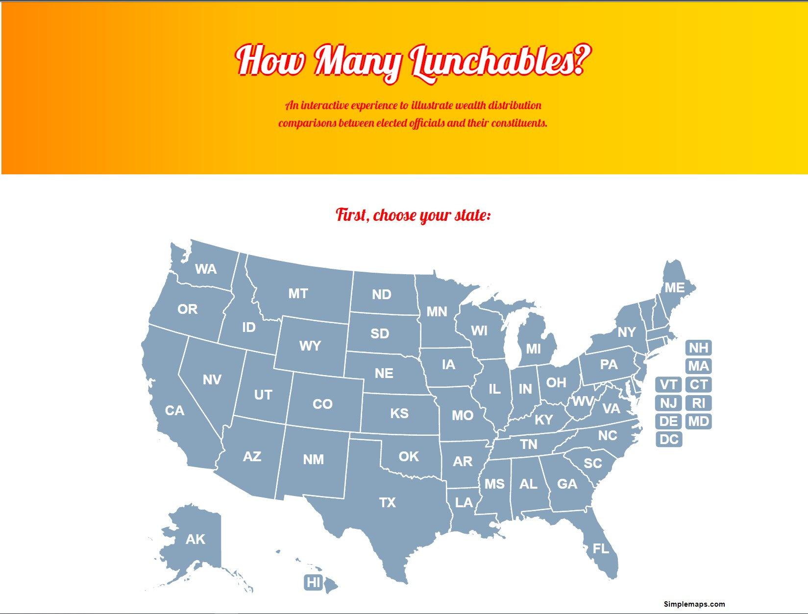

# us_representative_lunchables

## USER STORY
```
AS A concerned US citizen 
I WANT to visually see the discrepancy between my representative's net worth and their constituents
SO THAT I can make an informed decision at the polls 
```

## Acceptance Criteria 
```
GIVEN I want to compare a state rep to their average constituent
WHEN I load the page, I want to see previous loads
THEN I can look back through my past searches
WHEN I click on a state
THEN the list of State Representatives appear
WHEN I choose a rep from the drop down
THEN I should see whether they are available for comparison
WHEN I have chosen someone who is available for comparison
THEN I want to see options of how to compare
WHEN I choose an item,
THEN I am given a comparison of how many of that item the congressperson could buy and how many of that item a constituent could buy with the median net worth of a constituent in that state
WHEN I click on an image at the bottom
THEN I should be able to restart comparisons with all three objects
WHEN I resize the page
THEN the layout should rearrange to be easier to read depending on screen size
```

## Description 
An interactive experience, with cultural relevance. Goal: To illustrate the wealth disparity between congress representatives and their constituents. This web application will display a humorous comparison between common items a representative can afford vs what their constituents can afford.

Select your state, choose a representative and then select and item to compare what the selected representative can afford vs their constituants. 

## Technologies Used
```
- Bootstrap
- jQuery
- SimpleMaps.com
- Google Fonts
- MediaWiki API
- OpenSecrets API
    - getLegislators API
    - memPFDProfile API XML
```


## GIT HUB REPO
https://github.com/erheltemes/us_representative_lunchables

## GIT HUB LIVE SITE
https://erheltemes.github.io/us_representative_lunchables/

## SCREENSHOTS



